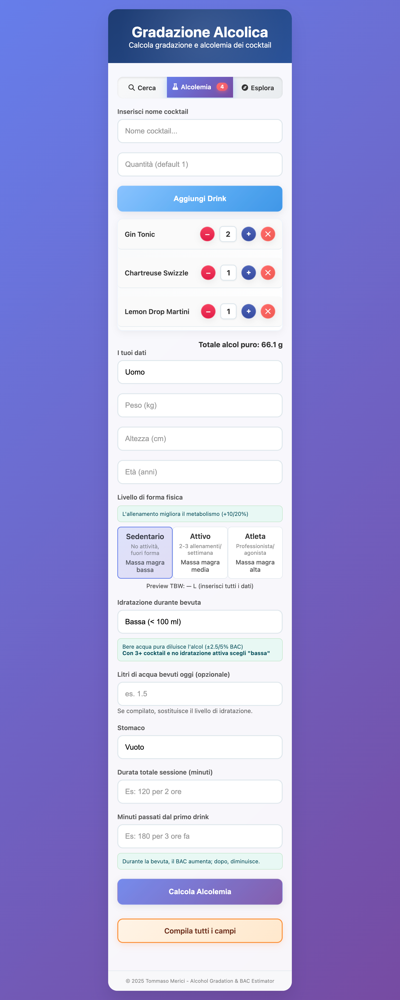
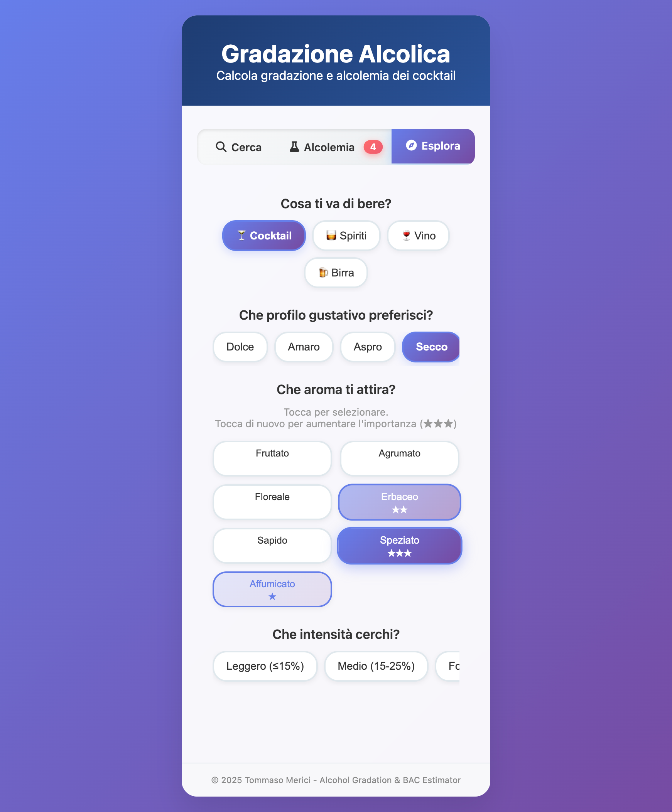
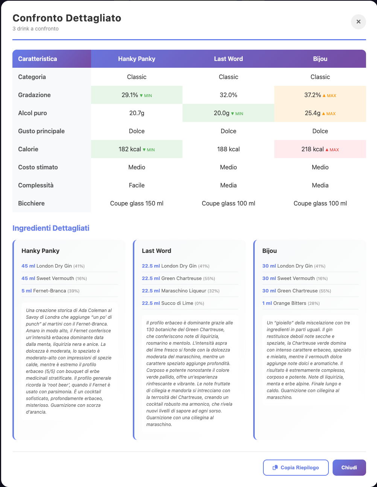
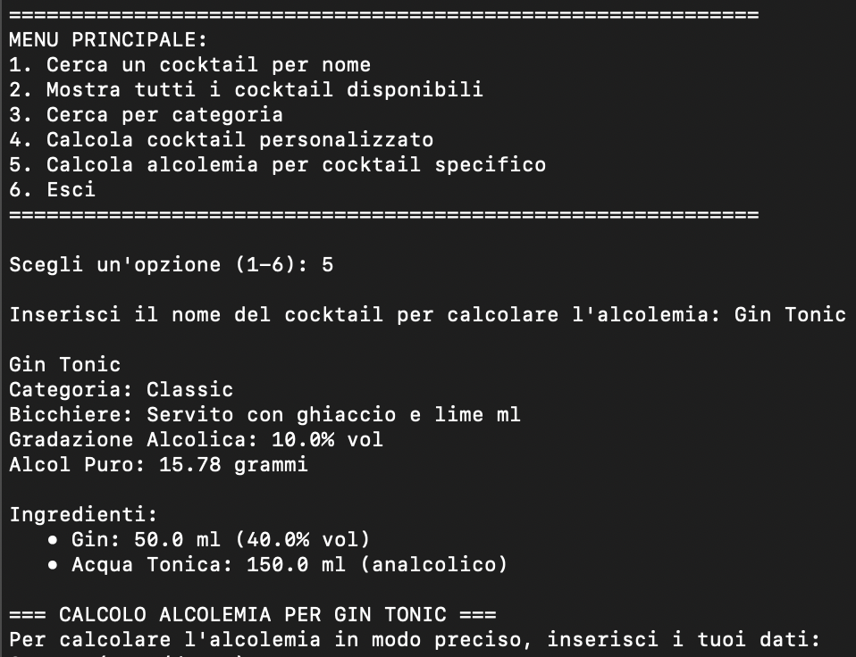
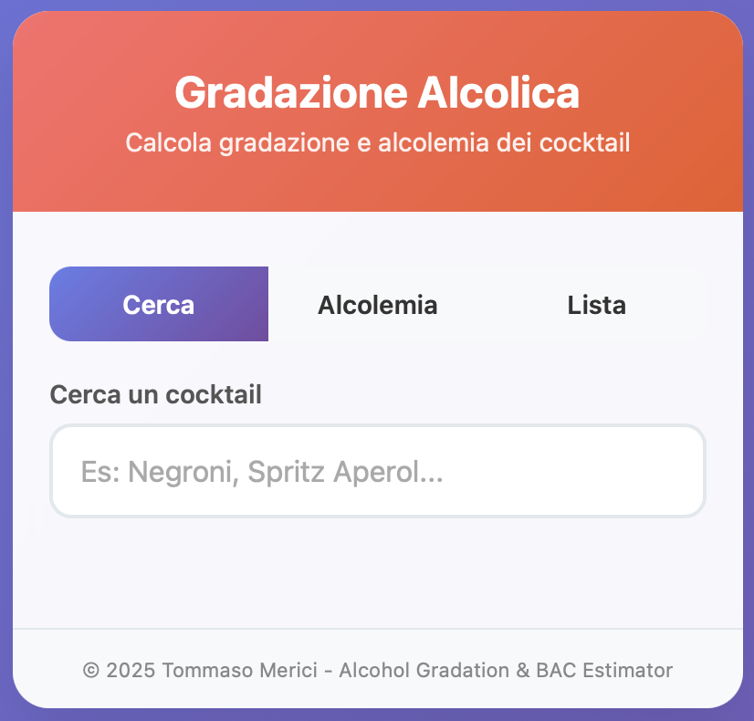
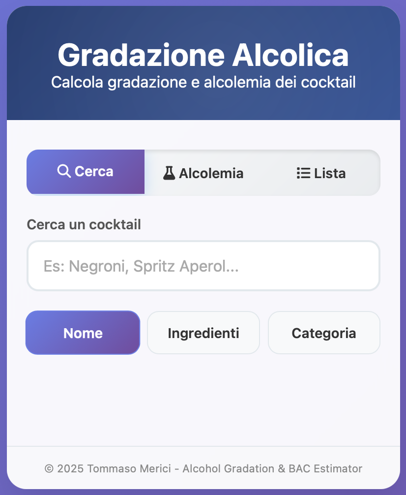

# Calcolatore Gradazione Alcolica e Stima Alcolemia - Web App

<div align="center">


</div>

---

Una sera d’estate di un non meglio specificato giorno della settimana, mi trovavo con i miei amici in un bar nella mia città. La noia, quella tagliente compagna che si materializza nei momenti più inaspettati, mi stava divorando, così ho cominciato a guardare intensamente il bicchiere di gin tonic saldo nella mia mano sinistra (mai tenere il drink con la mano dominante...). *Chissà qual è il grado alcolico effettivo di questa bevanda*, pensai.

Il mio sguardo si perse per un attimo nella folla di giovani che consumavano allegramente bevande alcoliche, raccolti in gruppetti trainati da innocente spensieratezza. Quanti di loro lo vorrebbero sapere? Quanti di loro vorrebbero conoscere il proprio tasso alcolemico dopo una serata, con la stessa precisione con cui consultano il saldo del conto corrente e si promettono poi di smettere?</br>
Molti, secondo me. Tutti, probabilmente.

Quante volte ci abbandoniamo alla dea fortuna in un insensato gioco probabilistico dal valore atteso certamente negativo? Più spesso di quello che immaginiamo, d’altronde pure gli esperti inciampano nella *gambler’s fallacy*, anche se per gradi di difficoltà diversi dal comune mortale che ordina “ancora uno, l’ultimo” convinto di essere perfettamente lucido.

Sia mai vietarmi una metaforica passeggiata che si sarebbe presto trasformata in 40 ciclotimici giorni nel deserto. Sia mai che io mi perda una battaglia persa.

È così, foriero d’un lampo, che nasce questa applicazione web per il calcolo scientifico della gradazione alcolica dei cocktail, compresa di una stima dell’alcolemia basata sulla formula di Widmark avanzata. Il progetto è nato come strumento educativo per la consapevolezza del consumo di alcol e la prevenzione della guida in stato di ebbrezza.

---

## 🔗 Versioni Disponibili

Nessuna installazione è richiesta, funziona su qualsiasi dispositivo moderno. È ottimizzata per mobile, la principale destinazione d’uso per cui è pensata.</br>
Requisiti Desktop: Browser moderno (Chrome 80+, Firefox 75+, Safari 13+)

### v2.0 - Foundation (Open Source)
Prima versione web completa con calcoli di farmacocinetica avanzati.
```
https://tmericj.github.io/cocktail-calculator/cocktail-app.html
```

### v3.0 - Modern Architecture (Open Source)
Architettura completamente rinnovata con database esteso, design mobile-first e sezioni dedicate.
```
https://cocktail-app-v3.netlify.app
```

### v5.0 - Complete Experience (Current - Private)
Versione attuale con sistema di raccomandazione intelligente, quiz guidato, confronto drink e oltre 700 bevande catalogate.  
*Per uso strettamente personale, è disponibile su richiesta una versione intermedia.*

---

## 📱 Guida Utente

L’applicazione è strutturata in **tre sezioni principali** accessibili tramite barra di navigazione:

### 1️⃣ CERCA - Database Completo
Esplora oltre 700 bevande catalogate (cocktail IBA, aperitivi regionali, spiriti. Etichette di birre e vini verranno presto inseriti nel database, al momento sono presenti solo come macro categorie).

**Funzionalità:**
- **Ricerca rapida** per nome o ingrediente (case-insensitive, ricerca parziale);
- **Filtri avanzati** per categoria e ingredienti specifici. Il filtro di ricerca per “nome” è attivo di default;
- **Card dettagliate** con: gradazione, alcol puro (g), bicchiere, metodo di preparazione, ingredienti precisi, note degustative;
- **Aggiunta diretta** al calcolo alcolemia tramite pulsante "+"

### 2️⃣ ALCOLEMIA - Calcolo Scientifico BAC
Stima il tasso alcolemico basato su parametri biometrici e condizioni di consumo.

**Come funziona:**
1. **Inserisci i dati biometrici**: sesso, peso, altezza, età
2. **Definisci il contesto di consumo**
   - Livello di fitness (sedentario/attivo/atleta) → influisce sul metabolismo
   - Idratazione durante consumo → influisce sulla diluizione
   - Idratazione durante il giorno (opzionale) → influisce sulla diluizione
   - Esercizio fisico oggi → modifica il tasso di eliminazione
   - Stomaco pieno/vuoto → -30% assorbimento se pieno
3. **Aggiungi le bevute**
   - Cerca drink dal database o inserisci manualmente
   - Specifica e modifica le quantità direttamente dal riepilogo
   - Inserisci il tempo di ingestione:
    > **Durata totale sessione (minuti)**: minuti passati dal primo sorso del primo drink all’ultimo sorso dell’ultimo drink.

    > **Minuti passati dal primo drink**: minuti passati dal primo sorso del primo drink al momento preciso in cui vuoi calcolare il BAC.

    **Esempio pratico:**

    Sei in un bar e ordini 1 Americano. Ti viene servito alle ore 19:00.
    - Ore 19:00 → fai il primo sorso di Americano
    - Ore 19:30 → ordini e bevi 1 Negroni  
    - Ore 20:00 → ordini e bevi 1 Boulevardier
    - Ore 20:30 → finisci l’ultimo drink.
    - Ore 21:00 → vuoi calcolare il tuo BAC attuale

    **Cosa inserire:**
    - **Durata totale sessione**: 90 minuti (dalle 19:00 alle 20:30)
    - **Minuti passati dal primo drink**: 120 minuti (dalle 19:00 alle 21:00)

    Questa distinzione serve all’app per capire da quanto tempo hai smesso di bere. È importante riportare i periodi di tempo in modo preciso.</br>**⚠️ Nota importante:** "Minuti passati dal primo drink" deve essere **≥** "Durata totale sessione" (non puoi calcolare il BAC prima di aver finito di bere).
4. **Calcola alcolemia**. Ti verranno mostrati i risultati:
   - BAC corrente e picco stimato, mostrati con intervalli di confidenza (95%)
   - Classificazione legale italiana 
   - Tempo stimato per tornare sotto i limiti legali e poi a 0.00 g/L
   - Total Body Water in litri, mostrati con intervalli di confidenza (95%)
   - Timeline predittiva fino a 6 ore, mostrata con intervalli di confidenza (95%)

**Features aggiuntive:**
- Autocomplete intelligente durante digitazione
- Riepilogo drink con real time counter e +/- per modifiche veloci
- Animazione caricamento calcolo
- Warning Banner per ricordare che si tratta di calcoli teorici

### 3️⃣ ESPLORA - Raccomandazione Intelligente

**Quiz Guidato “Cosa ti va di bere?”**  
Sistema di matching avanzato con scoring multilivello.

**Come funziona il quiz:**
1. **Scegli tipo bevanda**: Cocktail / Spiriti / Vino / Birra
2. **Per Cocktail**:
   - Gusto preferito (dolce, amaro, aspro, secco, equilibrato);
   - Aromi preferiti (fruttato, agrumato, floreale, erbaceo, sapido, speziato, affumicato);
   - Puoi scegliere più di un aroma e specificarne la gerarchia con un sistema di **priorità** a stelle (★, ★★, ★★★);
   - Intensità alcolica (leggera, media, forte);
   - Corpo (rinfrescante, leggero, cremoso/setoso, corposo, effervescente);
3. **Per Spiriti**:
   - Come lo bevi (shot, degustazione lenta, on the rocks);
   - Famiglia spirito (whisky, gin, rum, vodka, tequila/mezcal, cognac/brandy, amari, vermouth, grappa, liquori generici);
   - Carattere preferito (dolce, secco, speziato, cremoso, morbido, robusto, invecchiato, elegante, affumicato, fruttato, agrumato, floreale, erbaceo, piccante);
   - Puoi scegliere anche caratteri secondari, specificandone la gerarchia con un sistema di **priorità** a stelle (★, ★★, ★★★);
4. **Vino e Birra**:
  - per il vino scegli la categoria (rosso, bianco, rosato, spumante/champagne, dolce/passito) e la struttura (leggero, medio corpo, corposo, tannico);
  - per la birra scegli la categoria (lager/pilsner, ale, weiss/blanche, ipa, stout/porter, ambrata) e intensità (leggera, media, forte);

**Risultati Quiz:**
- **Card espandibili** con match score e classificazione in gruppi (Perfetto/Buono/Alternativa/Non Consigliati);
- **Pulsante “i”** per scheda dettagliata in overlay;
- **Pulsante “Confronta”** per salvare drink nel comparatore (diventa verde quando premuto; max 5 per confronto);
- **Pulsante “Aggiungi”** per trasferire drink alla sezione Alcolemia (diventa verde quando premuto);

**Sistema di Confronto ⚖️**  
Clicca sull’emoji bilancia in basso a destra per accedere al confronto.

**Welcome page confronto:**
- Visualizza riepilogo scelte salvate
- Gestisci le scelte: rimuovi singoli drink o svuota tutto
- Accedi a “Confronto Dettagliato”

**Confronto Dettagliato:**
- **Desktop**: tabella comparativa side-by-side
- **Mobile**: card scorrevoli stile Instagram Stories
- **Metriche confrontate**: Categoria, Gradazione, Alcol puro (g), Gusto principale, Calorie, Costo stimato, Complessità di creazione, Bicchiere
- **Evidenziazioni**: MIN (verde) e MAX (rosso) per gradazione, alcol puro, calorie

**Altre Sezioni Explore (In Development):**
- **Percorsi di Degustazione**: collezioni tematiche curate (es. "Italian Aperitivo", "Caribbean Flavors")
- **Cosa Posso Creare?**: scopri cosa preparare con gli ingredienti che hai. Pensato per il calcolo dell’alcolemia in contesti goliardici non ortodossi, quando il barman è il tuo amico che ti delizia con un long drink 90% gin e 10% tonica.

---

## Evoluzione del Progetto

Questo tool ha attraversato una significativa trasformazione architetturale, passando da una primitiva applicazione Python da terminale a una web app completa con intelligenza artificiale per le raccomandazioni.

**v1.0 (Luglio 2025) - Le Origini**  
Tutto inizia con un’applicazione Python da terminale: 52 cocktail IBA, calcoli farmacinetici basilari con formula di Widmark e Watson TBW, un menu interattivo a 7 opzioni. L’errore medio rispetto a misurazioni reali con etilometro era del 71% - accettabile per un prototipo educativo, ma evidentemente perfettibile.

**v2.0 (Agosto 2025) - La Svolta Web**  
Il salto nel web porta con sé la prima vera evoluzione scientifica: **modello farmacocinetico** distribuito per bevute multiple, parametri di fitness con boost metabolico (+5-15%), e un database espanso a 120+ bevande. L’accuratezza migliora drasticamente e l’interfaccia responsive segna l’inizio dell’ottimizzazione mobile-first.

**v3.0 (Settembre 2025) - Architettura Moderna** ⭐ *Open Source*  
La trasformazione è completa: database espanso a 250+ bevande con specialità regionali venete, architettura a tre sezioni dedicate (Cerca / Alcolemia / Lista), design mobile-first con CSS Grid. Sul fronte scientifico, vengono introdotti 4 livelli di idratazione e l’effetto dell’esercizio fisico acuto sul metabolismo dell’alcol. Single-file architecture senza dipendenze esterne garantisce portabilità totale.

**v4.4 (Ottobre 2025) - La Rivoluzione del Quiz** ⭐  
Il salto concettuale più significativo: nasce la sezione **Esplora** con un sistema di **quiz intelligente** basato su multi-selezione con priorità (★, ★★, ★★★). Non più scelte binarie, ma sfumature: l’utente può indicare l’intensità delle proprie preferenze per aromi e caratteristiche. Il database cresce a 500+ bevande, il sistema di scoring diventa sofisticato. Dopo un periodo di ‘development hell’ con bug critici su Safari (v4.4-prove → v4.6), la v4.7 porta un refactoring completo con architettura modulare (ViewManager, QuizStateManager) che stabilizza definitivamente l’applicazione. La v4.9 completa l’esperienza con il sistema di confronto avanzato: fino a 5 drink confrontabili con layout adattivo (tabella su desktop, card scorrevoli stile Instagram Stories su mobile).

**v5.0 (Novembre 2025) - Advanced Rule-Based Matching** ⭐ *Current*  
L’algoritmo di matching viene riscritto da zero: tag system a 2 livelli per gli spiriti (primari/secondari), sistema di penalità sofisticato per i mismatch, scoring normalizzato 0-100 con classificazioni chiare. Il database raggiunge le **735 bevande** completamente catalogate, ognuna con note degustative approfondite, profili sensoriali dettagliati, alcune storie d’origine e varianti, metadati completi. Non più solo un calcolatore, ma un vero **assistente alla scoperta** del mondo dei cocktail e degli spiriti.

---


## 🔬 Fondamenti Scientifici
### Calcolo della Gradazione Alcolica
La gradazione è calcolata usando la formula del volume pesato:
```
Gradazione = (Σ Volume_ingrediente × Gradazione_ingrediente) / Volume_totale × 100
```

Il contenuto di alcol puro in grammi utilizza la densità dell'etanolo (0.789 g/mL) e include un dizionario di fattori di diluizione, che variano in base al metodo di preparazione e alla temperatura di servizio, e tengono conto anche di ghiaccio sciolto, errori durante la preparazione o drink non completamente finiti.

### Sistema di Calcolo Alcolemia
#### Formula di Widmark Modificata
L'applicazione implementa la formula di Widmark con il calcolo personalizzato del Total Body Water (TBW) secondo Watson et al.:

```
TBW_uomo = 2.447 - (0.09516 × età) + (0.1074 × altezza_cm) + (0.3362 × peso_kg)
TBW_donna = -2.097 + (0.1069 × altezza_cm) + (0.2466 × peso_kg)

Fattore_Widmark = TBW / Peso_corporeo

BAC = (grammi_alcol × fattori_correzione) / (peso × fattore_Widmark) - (β × tempo_ore)
```

Fonte: P E Watson, I D Watson, R D Batt, (1980). Total body water volumes for adult males and females estimated from simple anthropometric measurements, *The American Journal of Clinical Nutrition*, *33*(1), 27-39. DOI: https://doi.org/10.1093/ajcn/33.1.27.

#### Fattori di Correzione Avanzati
| Parametro | Effetto | Rationale Fisiologico |
|-----------|---------|----------------------|
| **Fitness Sedentario** | Baseline | Metabolismo epatico standard |
| **Fitness Attivo** | +5% metabolismo | Migliore funzionalità epatica, ↑ massa magra |
| **Fitness Atleta** | +10% metabolismo | ↑ Enzimi CYP2E1, ↑↑ massa magra (75% $H_2O$) |
| **Idratazione Assente** | -1% efficienza | Disidratazione riduce metabolismo dell’alcol |
| **Idratazione Media** | +1.5% TBW | Volume distribuzione ↑ → BAC iniziale ↓ |
| **Idratazione Alta** | +2.5% TBW | Volume distribuzione ↑↑ → BAC iniziale ↓↓ |
| **Esercizio oggi** | -1% eliminazione | Disidratazione muscolare post-workout |
| **Stomaco pieno** | -30% assorbimento | Ritardo svuotamento gastrico, ↓ picco |


Da ciò si evince che le **persone allenate** metabolizzano l’alcol più efficacemente grazie a una migliore funzionalità epatica e una maggiore proporzione di massa magra. Poiché l’alcol si distribuisce nell’acqua corporea e i muscoli contengono circa il 75% di acqua contro il 10% del tessuto adiposo, gli atleti hanno un volume di distribuzione maggiore a parità di peso, che comporta una diluizione iniziale superiore dell’alcol in circolo. Anche per questo motivo viene considerato il livello di idratazione, che incide positivamente nel calcolo della TBW, aiutando a ridurre marginalmente l’effetto dell’alcol. Tuttavia, se l’utente si è allenato lo stesso giorno del consumo, il sistema applica una riduzione del 1% del tasso di eliminazione a causa della disidratazione muscolare.

In conclusione, una persona **allenata** e **idratata** presenta un **metabolismo più rapido** e una maggiore capacità di diluizione iniziale, motivi per cui registra un livello alcolemico più basso che smaltisce più velocemente.

#### Simulazione Temporale
Per sessioni di bevute multiple, l’algoritmo simula l’assorbimento e l’eliminazione nel tempo:
- Calcola gli intervalli tra le ingestioni basandosi sulla durata totale
- Sfrutta il modello Weibull modificato con lag time differenziato (5-15 min)
- Considera un assorbimento bifasico: fase gastrica + duodenale (picco 30-60 min)
- Considera l’effetto dello stomaco pieno (-30% assorbimento)
- Eliminazione Michaelis-Menten con tasso personalizzato (15-30 mg/dL/h)
- Genera una timeline predittiva fino a 6 ore

### Limiti Legali Italiani (Guida)

| BAC (g/L) | Status | Sanzioni |
|-----------|--------|----------|
| 0.0 - 0.5 | Legale | Guida consentita |
| 0.5 - 0.8 | Infrazione | Multa 527-2108€, sospensione 3-6 mesi |
| 0.8 - 1.5 | Reato | Arresto fino a 6 mesi, multa 800-3200€ |
| > 1.5 | Reato grave | Arresto 6-12 mesi, confisca veicolo |

---

## 🛠️ Tech Stack
**Frontend:**
- Vanilla HTML5 / CSS3 / JavaScript (ES6+)
- No external dependencies / frameworks
- Single-file architecture per facilità di deployment

**Design:**
- Mobile-first responsive (CSS Grid + Flexbox)
- Glassmorphism UI elements
- Touch-optimized interactions
- Gradient-based color scheme (professional blue palette)

**Data:**
- Client-side database (700+ drinks in JSON structure)
- Real-time calculations (no server required)
- Privacy-first: zero data transmission

L’applicazione mantiene lo stato delle bevute aggiunte in memoria, permettendo modifiche dinamiche della composizione della sessione senza perdita di dati.

**Compatibility:**
- Chrome 80+, Firefox 75+, Safari 13+
- iOS Safari optimized
- Progressive Web App ready
- Mobile App rolling out soon

---

## ⚠️ Disclaimer e Limitazioni

### Accuratezza Scientifica
- **Margine errore teorico**: ±20-30% (tipico per calcoli farmacocinetica)
- **Fattori non modellabili**:
  - Polimorfismi genetici (CYP2E1, ADH1B, ALDH2)
  - Condizioni mediche (epatopatie, diabete)
  - Farmaci (antibiotici, antistaminici, analgesici)
  - Tolleranza acquisita (consumo cronico)
  - Variabilità circadiana metabolismo

### Uso Educativo
**Questa applicazione NON sostituisce:**
- Misurazioni etilometriche certificate
- Valutazioni mediche professionali
- Decisioni legali sulla guida

**Scopo:** consapevolezza, educazione, prevenzione.  
**Mai guidare dopo aver bevuto alcol**, indipendentemente dalle stime calcolate.

### Validazione
L’algoritmo è stato calibrato confrontando la letteratura con alcuni casi reali, ottenendo errore medio del 27% (v2.0). È in programma un **trial scientifico** in condizioni reali perpetrato tramite misurazioni con etilometro, atto ad affinare le funzioni di stima del BAC. I metodi e i risultati verranno riportati qui.  Tuttavia, la variabilità individuale può essere significativa.

---

## 📂 Struttura Codebase

```
cocktail-calculator/
├── cocktail-app.html              # v2.0 (Open Source - Foundation)
├── cocktail-app-v3.0.html         # v3.0 (Open Source - Modern Architecture)
├── cocktail-app-v5.0.html         # v5.0 (Current - Private)
├── README.md                      # Documentazione
├── Evolution_Comparison/          # Screenshot evoluzione UI
│   ├── Python_Version.png
│   ├── First_Web_App.png
│   └── Second_Web_App.png
└── [legacy]/                      # Versione Python originale
    ├── gradazione_tool.py
    ├── database_ricette.csv
    └── test_tool.py
```

---

## Roadmap Futura

### Short-term (v5.1-v5.5)
- [ ] **Percorsi di Degustazione**: collezioni tematiche curate
  - Italian Aperitivo (Negroni, Spritz variations, Americano)
  - Caribbean Classics (Daiquiri, Mojito, Ti’ Punch, Piña Colada)
  - Tiki Universe (Mai Tai, Zombie, Painkiller)
  - Prohibition Era (Manhattan variations, Old Fashioned, Sazerac)
  
- [ ] **Build Your Own Drink**: 
  - Database 1000+ ingredienti (base spirits, liqueurs, mixers, bitters, syrups)
  - Calcolo automatico ABV e profilo sensoriale
  - Suggerimenti bilanciamento (classiche proporzioni: sour 2:1:1, Manhattan 2:1, etc.)
  - Salvataggio ricette personalizzate

### Mid-term (v6.0)
- [ ] **User Profiles System**:
  - Dati biometrici memorizzati (crittografati localmente)
  - Preferenze calcolo personalizzate
  - Storico sessioni per analisi longitudinale
  - Cocktail/ricette preferite
  
- [ ] **Advanced Analytics**:
  - Grafici evoluzione BAC multi-sessione
  - Statistiche consumo (drink type, frequenza, pattern temporali)
  - Correlation fitness level / metabolismo osservato
  
- [ ] **Social Features (Privacy-first)**:
  - Condivisione ricette custom (anonima)
  - Rating community per cocktail database
  - Import/Export profili (JSON crittografato)

### Long-term (v7.0+)
- [ ] **Internationalization**: EN, ES, FR, DE translations
- [ ] **Geolocation Integration**: 
  - Limiti legali locali automatici (EU, US states, UK, AU)
  - Servizi taxi/ride-sharing nearby
  
- [ ] **Wearable Integration**:
  - Apple Health / Google Fit sync (peso, fitness level)
  - Smartwatch complications per quick BAC check
  
- [ ] **AR Features**:
  - Riconoscimento cocktail da foto (ML model)
  - Overlay informazioni su drink in contesto reale

### Research & Validation
- [ ] **Clinical Study Partnership**: validazione algoritmo con dati ospedalieri anonimi
- [ ] **Monte Carlo Simulation**: quantificazione uncertainty con 10,000+ iterazioni
- [ ] **Machine Learning**: personalizzazione parametri metabolici da storico misurazioni utente

---

## Interface Preview

### Sezione 1: 🔍 Cerca

In questa prima sezione si può esplorare l’intero database cercando le bevande per nome (filtro attivo di default, rimuovibile), o attivando (anche cumulativamente) i filtri per “ingredienti” e per “categoria”. Se si attiva il filtro “ingredienti”, oppure il match type indica che la query cercata è stata trovata nelle note, il risultato viene evidenziato.

<div align="center">
  <p><em>Sezione Cerca: database completo con filtri avanzati</em></p>
  
</div>

---
### Sezione 2: 🧪 Alcolemia

Questa sezione è il cuore scientifico dell’app, dove avviene il calcolo della stima del BAC.

<div align="center">
  <p><em>Sezione Alcolemia: come si presenta</em></p>
  

---

  **Autocomplete Intelligente nella Sezione Alcolemia**

  Suggerimenti in tempo reale durante la digitazione del nome drink - seleziona per aggiungere automaticamente al riepilogo bevute.

  

  *Se nel box apposito non si inserisce alcuna quantità, l’app di default considera 1, come avviene in questo esempio*

---

  <p><em>Sezione Alcolemia: calcolo scientifico con timeline predittiva</em></p>
  

  *Questo è un esempio con dati reali*

</div>

---
### Sezione 3: 🧭 Esplora

In questa sezione 

<div align="center">
  <p><em>Sezione Esplora: quiz guidato con risultati intelligenti</em></p>
  

  ---

  **Quiz multi-select con Sistema di Priorità**

  Sistema di selezione multipla con intensità graduata (★, ★★, ★★★)

  

  *Click ripetuti sullo stesso aroma/caratteristica aumentano la priorità, influenzando il matching score*

  ---

  <p><em>Sezione Esplora: risultati quiz guidato</em></p>
  

  ---

  **Espansione Card Risultati Quiz**

  Segui il cursore per scoprire tutte le funzionalità delle card risultato.

  

  *Card compatte espandibili on-click con dettagli completi, note degustative, e pulsanti azione (Aggiungi/Confronta)*

  ---

  **Confronto Dettagliato** 

  La funzione “Confronto Dettagliato” assume una veste grafica diversa, a seconda che la si sperimenti su desktop/tablet o su smartphone.

  <p><em>Card swipeable Mobile experience</em></p>
  

  *Navigazione fluida tra drink salvati con swipe laterale - evidenziazioni MIN (verde) e MAX (rosso) per metriche chiave*

  ---

  <p><em>Tabella confronto Desktop experience</em></p>
  

</div>

---
---

### Evolution Comparison (front page)
<div align="center">
  
**v1.0 - Python Terminal**  


**v2.0 - First Web App**  


**v3.0 - Modern Web App**  


</div>

---
---

## 📄 License

MIT License - Feel free to use, modify, and distribute.

**Attribution appreciated but not required.**

---

## Credits

**Development:** Tommaso Merici   
**Scientific References:**
- Watson PE et al. (1980) - TBW calculation methodology
- Searle JW (2015) - Fitness effects on metabolism
- Jones AW (2019) - Alcohol absorption kinetics
- Levitt DG et al. (2020) - Biphasic absorption modeling

**Cocktail Database Sources:**
- IBA Official Cocktail List
- Difford’s Guide
- PDT Cocktail Book
- Death & Co Modern Classic Cocktails

---

<div align="center">

**Bevi responsabilmente. Non guidare mai dopo aver bevuto alcol.**

*Tool sviluppato per educazione alla sicurezza stradale e consapevolezza del consumo responsabile.*

---

*Last Updated: December 2025 - v5.0*

</div>
